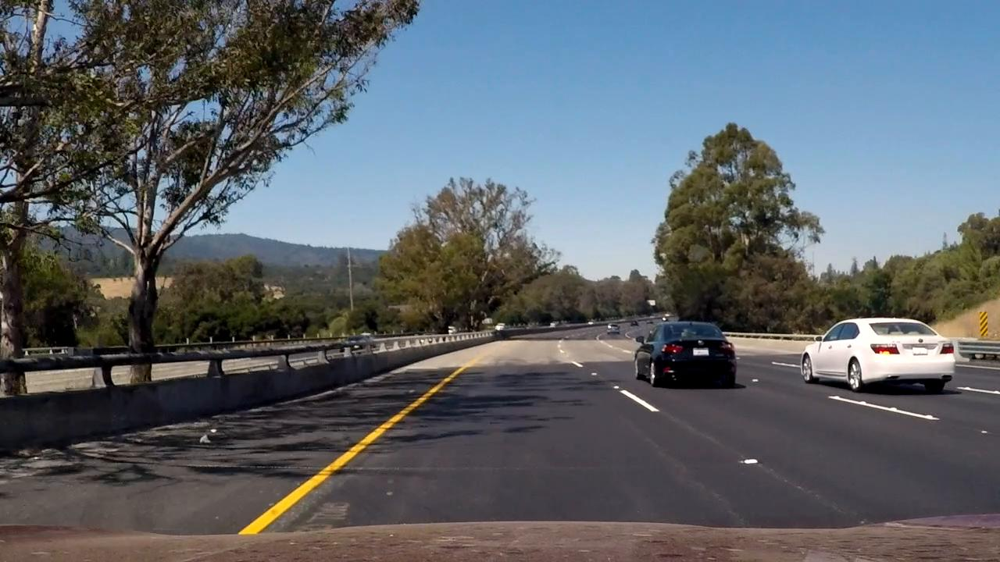
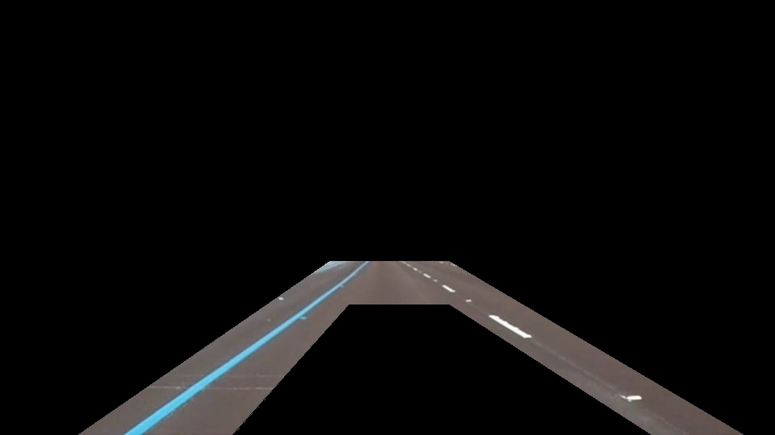

# **Finding Lane Lines on the Road** 

Pipeline description
---

After applying Gaussian blur filter and Canny filter two masks are applied
to the image. And the following shows the masked image:

This mask is designed to work based on left and right image ratio to ignore and tested to work for all the three test videos(including Optional Challenge).

The draw_lines() API implements the bulk of the algorithm to draw the lane lines
after Hough transform is applied. In short it attempts to use valid points on
the image that can make up lanes and groups those lines into two lanes and attempts to reduce unwanted lines. Please refer to the API documentation for
more details. 

This pipeline is an attempt at hand engineered algorithm that works well for
all the test videos provided including the Optional Challenge.

Green colored lines show what all lines are considered for drawing the red line.

Problems with implementation
---

The mask applied to the image, I am afraid, might not generalize well when the orientation of camera is off the center, when the road curves suddenly or
if the car orientation changes. The expectation should be that the lane finding algorithm should still point to original lanes or new lanes but not arbitary lines. 

Even lane detection is quite challenging, I think cv2.inRange() to look for lane
colors perhaps might help but there is quite a bit of variability with changing
lighting, worn out lanes, other traffic on the road, changes in road asphalt color
and the light / shadow which can all lead to false signals or no signals!.

Possible Improvements
---

An algorithm to detect and draw lanes can most likely be reduced to object detection of computer vision problem. It seems to me hand engineering will mostly likely lead to many cases not being covered and the resulting algorithm might not generalize well.